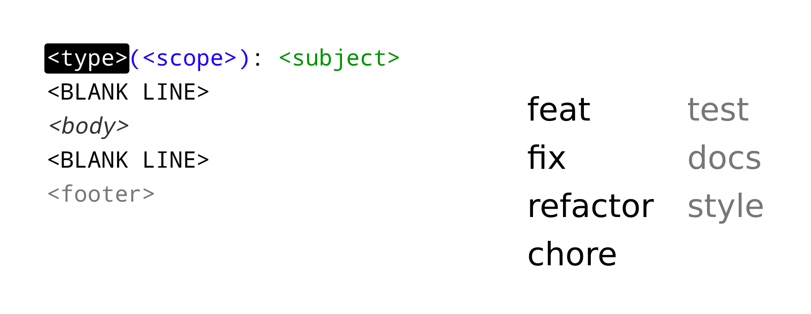
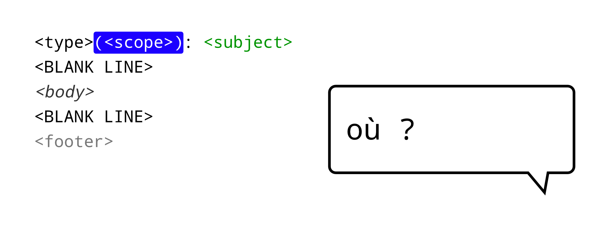
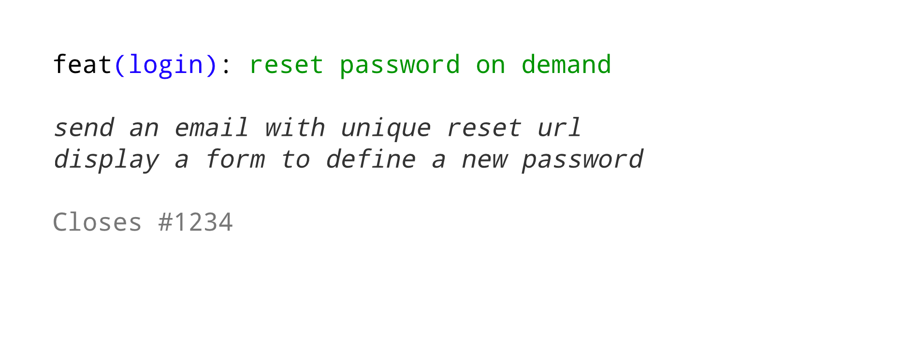
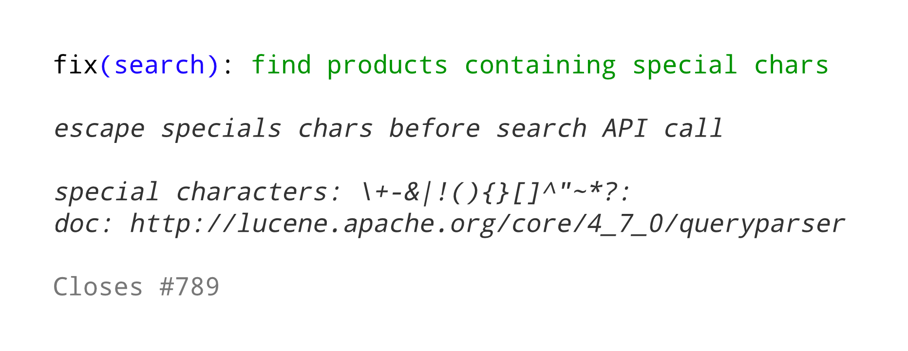

<!-- .slide: data-background="#F5AF33" -->

# Git++

*Passez au niveau supérieur de la gestion de version*

Note:
Qui utilise git ?  
Qui a trouvé git complexe au début ?

---

<!-- .slide: data-background="#F5AF33" class="oneColList" -->

##3 points pour améliorer la qualité

* Une vision
* Une méthode
* Des outils

---

<!-- .slide: data-background="img/cockpit.jpg" data-background-size="cover" -->

<!-- .element: class="fullImageCaption" -->
`man git (>_<)`

---

<!-- .slide: data-background="img/marteau.jpg" data-background-size="cover" -->

<!-- .element: class="fullImageCaption" -->
Git != SVN

---

<!-- .slide: data-background="url(img/couteau-suisse.jpg)" data-background-size="cover" -->

<!-- .element: class="fullImageCaption" -->
Git, un outil multi-fonction!

---

<!-- .slide: data-background="url(img/katana-couteau-suisse.png)" data-background-size="cover" -->

<!-- .element: class="fullImageCaption" -->
Git, une arme pour les NINJA!

Note:
Git va nous permettre de combattre un fléau trop répandu:
L'historique sale :-(

---

<!-- .slide: data-background="#F5AF33" -->

# Un historique sale

---

## Un historique sale

||
-- | -- | --
*   | 07fc819 | toto
*   | ba6383e | tests
*   | 66d8bdd | Merge branch 'US1234' into master
¦\  ||
¦ * | dba5ed1 | US1234 fix
¦ * | 66d8bdd | Merge master
¦/¦ ||
* ¦ | 04354b7 | css
¦ * | dbdeb5c | US1234
¦/  ||
*   | 5d994c4 | wip

---

<!-- .slide: data-background="#F5AF33" -->

# Un historique propre

## Mais pourquoi faire ?

---

<!-- .slide: data-background="img/men-in-black.jpg" data-background-size="cover" -->

<!-- .element: class="fullImageCaption" -->
Perte de mémoire

---

<!-- .slide: data-background="img/holiday.jpg" data-background-size="cover" -->

<!-- .element: class="fullImageCaption" -->
En cas d'absence

---

<!-- .slide: data-background="img/newbie.jpg" data-background-size="cover" -->

<!-- .element: class="fullImageCaption" -->
Arrivée d'un nouveau

---

<!-- .slide: data-background="img/pull-request-with-detailed-commits.png" data-background-size="cover" -->

<!-- .element: class="fullImageCaption" -->
Revue de code

---

<!-- .slide: data-background="#F5AF33" -->

# Donnons du sens   à notre historique

Note:
Quoi ? Où ? (Pour)quoi ? Comment ? Référence ?

---

## Conventions de commit

<!-- .slide: class="oneColList" -->

* AngularJS
* Karma runner
* Angular UI

---

<!-- .slide: data-transition="none" -->

## Conventions de commit

Note:
Quoi ? Où ? (Pour)quoi ? Comment ? Référence ?

---

<!-- .slide: data-transition="none" -->

## Conventions de commit

---

<!-- .slide: data-transition="none" -->

## Conventions de commit

Note:
feat     : fonctionnalité  
fix      : correctif  
refactor : changement technique  
chore    : changement build/config  
test     : test manquant  
docs     : changement dans la documentation  
style    : changement de formattage

---

<!-- .slide: data-transition="none" -->

## Conventions de commit

Note:
(optionnel)  
Listez vos scopes  
Faites les évoluer dans le temps

---

<!-- .slide: data-transition="none" -->

## Conventions de commit

Note:
Description des changements  
Point de vue utilisateur (feat, fix)
---

<!-- .slide: data-transition="none" -->

## Conventions de commit

Note:
(optionnel)  
Détails sur le sujet  
Détails d'implémentation

---

<!-- .slide: data-transition="none" -->

## Conventions de commit

Note:
(optionnel)  
Identifiant de bug fix  
Identifiant de user story  

---

<!-- .slide: data-transition="none" -->

## Exemple : Fonctionnalité

---

<!-- .slide: data-transition="none" -->

## Exemple : Résolution de bug

---

<!-- .slide: data-background="img/happy-dev.jpg" data-background-size="cover" -->

<!-- .element: class="fullImageCaption" -->
Des développeurs contents

---

<!-- .slide: data-background="#F5AF33" -->

# Générer   un changelog

---

<!-- .slide: data-background="img/changelog.png" data-background-size="contain" -->

---

<!-- .slide: data-background="img/happy-users.jpg" data-background-size="cover" -->

<!-- .element: class="fullImageCaption" -->
Des utilisateurs contents

---

<!-- .slide: data-background="#F5AF33" -->

# Améliorons   notre historique

---

<!-- .slide: class="twoColList" -->

## Ce qu'il faut savoir faire   sur un commit :

* Renommer
* Modifier
* Réordonner
* Fusionner
* Insérer
* Supprimer

---

<!-- .slide: data-background="#F5AF33" class="codeTitle" -->

# `git rebase -i`

---

# WAT ??

---

<!-- .slide: class="codeTitle" -->

# `git merge`

---

<!-- .slide: data-transition="none" -->

## Feature branch

---

<!-- .slide: data-transition="none" -->

## Feature branch

---

<!-- .slide: data-transition="none" -->

## Git merge

---

<!-- .slide: data-transition="none" -->

## Feature branch

---

<!-- .slide: data-transition="none" -->

## Git merge

---

<!-- .slide: data-transition="none" -->

## Git merge

---

<!-- .slide: class="codeTitle" -->

# `git rebase`

---

<!-- .slide: data-transition="none" -->

## Feature branch

---

<!-- .slide: data-transition="none" -->

## Git rebase

---

<!-- .slide: data-transition="none" -->

## Git rebase

---

<!-- .slide: data-transition="none" -->

## Git rebase

---

<!-- .slide: data-transition="none" -->

## Git rebase

---

<!-- .slide: data-transition="none" -->

## Git rebase

---

<!-- .slide: data-background="img/clean-vs-dirty-water.jpg" data-background-size="cover" -->

<!-- .element: class="fullImageCaption" -->
Git merge vs rebase

---

<!-- .slide: class="oneColList" -->

##Git merge vs rebase

* ;-) historique simple
* :-( perte du contexte de travail
* :-( plus difficile à maitriser

---

<!-- .slide: data-background="#5A0000" class="warningTitle" -->

#Git merge vs rebase

###attention au rebase de commits partagés

---

<!-- .slide: data-background="#F5AF33" class="codeTitle" -->

# `git rebase -i ?`

---

<!-- .slide: data-transition="none" -->

## Git rebase interactive

---

<!-- .slide: data-transition="none" -->

## Git rebase interactive

---

<!-- .slide: data-transition="none" -->

## Git rebase interactive

---

<!-- .slide: data-transition="none" -->

## Git rebase interactive

---

<!-- .slide: data-transition="none" -->

## Git rebase interactive

---

<!-- .slide: data-transition="none" -->

## Git rebase interactive

---

<!-- .slide: data-transition="none" -->

## Git rebase interactive

---

<!-- .slide: class="oneColList" -->

##Git rebase ? Git commit ? Git merge ?

1. Code privé ? rebase
2. Code review ? commit
3. Code ready ? rebase
4. Code merge ? merge !

---

<!-- .slide: data-background="#F5AF33" -->

#DEMO