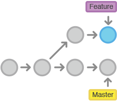
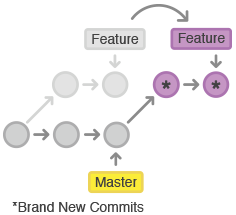
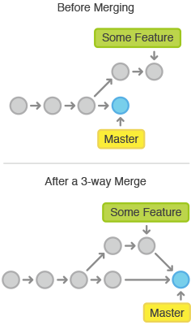
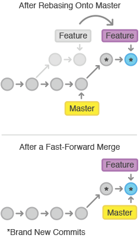

# Git++

*Passez au niveau supérieur<br>de la gestion de version*

---

# Git c'est dur!


---

# Git != SVN


---

# Git c'est pour les hommes à tout faire!


---

# Git c'est pour les ninja!


---

# Git c'est pour les ninjas à tout faire!


---

## Historique crappy

---

### Commit by stack

||
-- | -- | --
* | 1aa884d | repair test
* | 1d6dce9 | database stuff
* | a1751a5 | add more ui
* | aae0c16 | add tests
* | 0a9f8b4 | init service
* | a3cbbc1 | init ui

---

### Merge

||
--  | -- | --
*   | 66d8bdd | Merge branch 'search' into master
¦\  ||
¦ * | dba5ed1 | really crazy
* ¦ | dbdeb5c | totally crazy
¦/  ||
*   | 52f17e2 | Merge branch 'login' into master
¦\  ||
¦ * | d7efdff | add foobar
* ¦ | 31f7ab3 | crazy commit
¦/  ||

---

### Devinette

||
-- | -- | --
* | c0d5c87 | ..
* | 07fc819 | kikoolol
* | ba6383e | tests
* | 04354b7 | css
* | 01c3700 | save

---

### Revert

||
-- | -- | --
* | eb392a4 | add save on product listing with fix
* | fa18bda | Revert "add save on product listing"
* | 0018f52 | add logout
* | 1b0a6dc | add save on product listing
* | a99dab8 | add save on product listing

---

### Test

||
-- | -- | --
* | 9c09c68 | test

---

### User Story 1234

||
-- | -- | --
* | a84a4ab | US1234 ok
* | c68cc3f | US1234 fix
* | 434abc5 | US1234
* | de3e44f | US1234

---

### Work In Progress

||
-- | -- | --
* | 44a7b64 | WIP
* | 28d6f8d | wip
* | 3697320 | wip
* | 5d994c4 | wip

---

## Qualité de l'historique du code ? Pourquoi faire ?

---

### Un historique propre

||
-- | -- | --
* | 8fd025c | refactor(search): use a regex to escape special chars
* | 5a857ff | test(login): verify error display for bad email format
* | 57075a4 | fix(search): find products containing special chars
* | 2fc4a21 | refactor(login): extract login controller to ...
* | 2579469 | chore: update oauth plugin to latest security fix
* | 4548866 | feat(login): add remember me option
* | 696bdd2 | feat(login): allow reset password with email

---

### Perte de mémoire


---

### Retour de vacances


---

### Arrivée d'un nouveau


---


---

# Donner du sens aux changements du code

###Quoi ? Où ? (Pour)quoi ? (Comment ?) (Référence?)

---

## Convention de Commit

```diff
<type>(<scope>): <subject>
<BLANK LINE>
<body>
<BLANK LINE>
<footer>
```

---

## Exemple 1

```diff
feat(search): add automatic suggestions

we now use the new feature from the search API to provide
instant suggestions just below search inputs

* update component implementation to support automatic suggestion
* update component tests
* update component documentation
```

---

## Exemple 2

```diff
feat(login): reset password on demand

send an email with unique reset url
display a form to define a new password

Closes #1234
```

---

## Exemple 3

```diff
fix(search): find products containing special chars

escape specials chars before search API call

special characters: \+-&|!(){}[]^"~*?:
see related doc at: http://lucene.apache.org/core/4_7_0/queryparser/org/apache/lucene/queryparser/classic/package-summary.html#Escaping_Special_Characters

Closes #789
```

---
##Type : Quoi?

||
-- | --
| feat     | fonctionnalité
| fix      | correctif
| refactor | changement technique <br> (ni une fonctionnalité ni un correctif)
| chore    | changement build/config <br> ou outil tiers pour tester le code
|          | &nbsp;
| test     | test manquant
| docs     | changement dans la documentation
| style    | changement de formattage

---

## Scope : Où?

* <!-- .element: class="fragment" --> Optionnel
* <!-- .element: class="fragment" --> Listez vos scopes
* <!-- .element: class="fragment" --> Faites les évoluer dans le temps

* <!-- .element: class="fragment" --> product
* <!-- .element: class="fragment" --> editorial
* <!-- .element: class="fragment" --> family
* <!-- .element: class="fragment" --> model
* <!-- .element: class="fragment" --> attribut

* <!-- .element: class="fragment" --> (optionnel)

---

##Subject: (Pour)quoi?

* Description des changements

---

##Body: Comment?

* (optionnel)

##Footer: Référence?

* (optionnel)

###Breaking Changes

* (optionnel)

---

## Changelog

```
Changelog (mettre une image)

v5.8.2 (2014-02-21)

Bug Fixes

family:
	split files into services and directives (3a15c697)
	update style on multiple checks on queries (97185f0e)
queryPicker: replace != by ≠ in query picker operands (f16b3f7c)

Features

form: add empty fields behavior info message (23882829)
```

---
##Git rebase



---
##Git rebase



---
##Git merge



---
##Git rebase



---
##Git merge vs rebase


---
##Git merge vs rebase

* \+ historique simple
* \- perte du contexte de travail
* \- plus difficile à maitriser

###attention au rebase de commits publics

---

## Ce qu'il faut savoir faire sur un commit :

* Renommer
* Modifier
* Réordonner
* Fusionner
* Supprimer
* Découper

---
#DEMO
---
##Git merge vs rebase

* \+ historique simple
* \- perte du contexte de travail
* \- plus difficile à maitriser

###attention au rebase de commits publics

---
##Git rebase ? Git commit ? Git merge ?

* Code privé ? rebase
* Code review ? commit
* Code ready ? rebase

---
##Changelog

```bash
#update your version > edit your config file

grunt changelog

git commit

git push
```

---
##Changelog

```bash
grunt build bump-only:minor changelog bump-commit

```

---
