<!-- .slide: data-background="#F5AF33" -->

# Git++

*Passez au niveau supérieur<br>de la gestion de version*

Note:
Qui utilise git ? <br>
Qui a trouvé git complexe au début ?

---

<!-- .slide: data-background="img/cockpit.jpg" data-background-size="cover" -->

<!-- .element: class="fullImageCaption" -->
`man git (>_<)`

---

<!-- .slide: data-background="img/marteau.jpg" data-background-size="cover" -->

<!-- .element: class="fullImageCaption" -->
Git != SVN

---

<!-- .slide: data-background="url(img/couteau-suisse.jpg)" data-background-size="cover" -->

<!-- .element: class="fullImageCaption" -->
Git, un outil multi-fonction!

---

<!-- .slide: data-background="url(img/katana.jpg)" data-background-size="cover" -->

<!-- .element: class="fullImageCaption" -->
Git, un outil de précision!

---

<!-- .slide: data-background="url(img/katana-couteau-suisse.png)" data-background-size="cover" -->

<!-- .element: class="fullImageCaption" -->
Git, une outil de précision multi-fonction!

---

<!-- .slide: data-background="#F5AF33" -->

# Un historique sale

---

## Commit by stack

||
-- | -- | --
* | 1aa884d | repair test
* | 1d6dce9 | database stuff
* | a1751a5 | add more ui
* | aae0c16 | add tests
* | 0a9f8b4 | init service
* | a3cbbc1 | init ui

---

## Merge

||
--  | -- | --
*   | 66d8bdd | Merge branch 'search' into master
¦\  ||
¦ * | dba5ed1 | search by keyword
* ¦ | dbdeb5c | create product
¦/  ||
*   | 52f17e2 | Merge branch 'login' into master
¦\  ||
¦ * | d7efdff | login by email
* ¦ | 31f7ab3 | create customer
¦/  ||

---

## Devinette

||
-- | -- | --
* | c0d5c87 | ..
* | 07fc819 | kikoolol
* | ba6383e | tests
* | 04354b7 | css
* | 01c3700 | save

---

## User Story 1234

||
-- | -- | --
* | a84a4ab | US1234 ok
* | c68cc3f | US1234 fix
* | 434abc5 | US1234
* | de3e44f | US1234

---

## Work In Progress

||
-- | -- | --
* | 44a7b64 | WIP
* | 28d6f8d | ..
* | 3697320 | ..
* | 3697320 | wip
* | 5d994c4 | wip

---

<!-- .slide: data-background="#F5AF33" -->

# La qualité de l'historique du code ?

## Mais pourquoi faire ?

---

## Un historique propre

||
-- | -- | --
* | 8fd025c | refactor(search): use a regex to escape special chars
* | 5a857ff | test(login): verify error display for bad email format
* | 57075a4 | fix(search): find products containing special chars
* | 2fc4a21 | refactor(login): extract login controller to ...
* | 2579469 | chore: update oauth plugin to latest security fix
* | 4548866 | feat(login): add remember me option
* | 696bdd2 | feat(login): allow reset password with email

---

## Perte de mémoire


---

## Retour de vacances


---

## Arrivée d'un nouveau


---

## Collaboration via Pull Request


---

<!-- .slide: data-background="#F5AF33" -->

# Donnons du sens aux changements du code

## Quoi ? Où ? (Pour)quoi ? Comment ? Référence ?

---

## Convention de Commit

```diff
<type>(<scope>): <subject>
<BLANK LINE>
<body>
<BLANK LINE>
<footer>
```

---

## Exemple : Fonctionnalité

```diff
feat(search): suggest instant search queries

we now use the new feature from the search API to provide
instant suggestions just below search inputs
```

---

## Exemple : Résolution de bug

```diff
fix(search): find products containing special chars

escape specials chars before search API call

special characters: \+-&|!(){}[]^"~*?:
see related doc at:
http://lucene.apache.org/core/4_7_0/queryparser

Closes #789
```

---
##Type : Quoi ?

||
-- | --
| feat     | fonctionnalité
| fix      | correctif
| refactor | changement technique
| chore    | changement build/config
|          | &nbsp;
| test     | test manquant
| docs     | changement dans la documentation
| style    | changement de formattage

---

## Scope : Où ?

<!-- .slide: class="oneColList" -->

* (optionnel)
* Listez vos scopes
* Faites les évoluer dans le temps

---

## Exemples de scopes

```diff
fix(search): <subject>
feat(products): <subject>
refactor(login): <subject>
test(customers): <subject>
chore: <subject>
```
---

<!-- .slide: class="oneColList" -->

##Subject: (Pour)quoi ?

* Description des changements
* Point de vue utilisateur

---

<!-- .slide: class="oneColList" -->

##Body: Comment ?

* (optionnel)
* Détails sur le sujet
* Détails d'implémentation

---

<!-- .slide: class="oneColList" -->

##Footer: Référence ?

* (optionnel)
* Identifiant de bug fix
* Identifiant de user story

---

<!-- .slide: class="oneColList" -->

##Breaking Changes

* (optionnel)
* Changements incompatibles

---

## Convention de Commit

```diff
<type>(<scope>): <subject>
<BLANK LINE>
<body>
<BLANK LINE>
<footer>
```

---

<!-- .slide: data-background="#F5AF33" -->

# Retravaillons notre historique

---

<!-- .slide: class="twoColList" -->

## Ce qu'il faut savoir faire <br> sur un commit :


* Renommer
* Modifier
* Réordonner
* Fusionner
* Insérer
* Supprimer

---

<!-- .slide: data-background="#F5AF33" class="codeTitle" -->

# `git rebase -i`

---

# WAT ??

---

<!-- .slide: class="codeTitle" -->

# `git merge`

---

<!-- .slide: data-transition="none" -->

## Feature branch


---

<!-- .slide: data-transition="none" -->

## Feature branch


---

<!-- .slide: data-transition="none" -->

## Feature branch

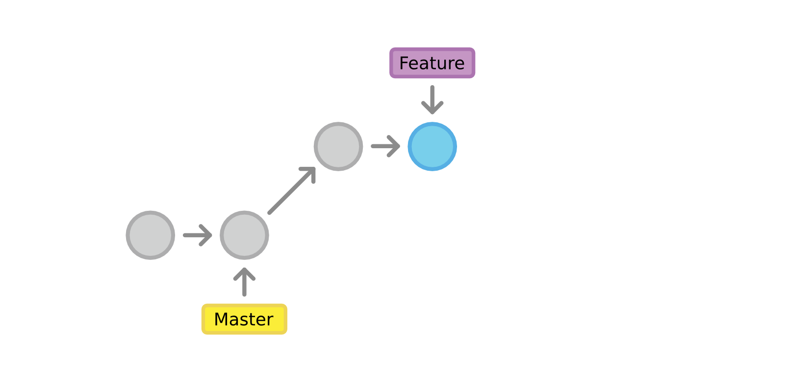

---

<!-- .slide: data-transition="none" -->

## Feature branch

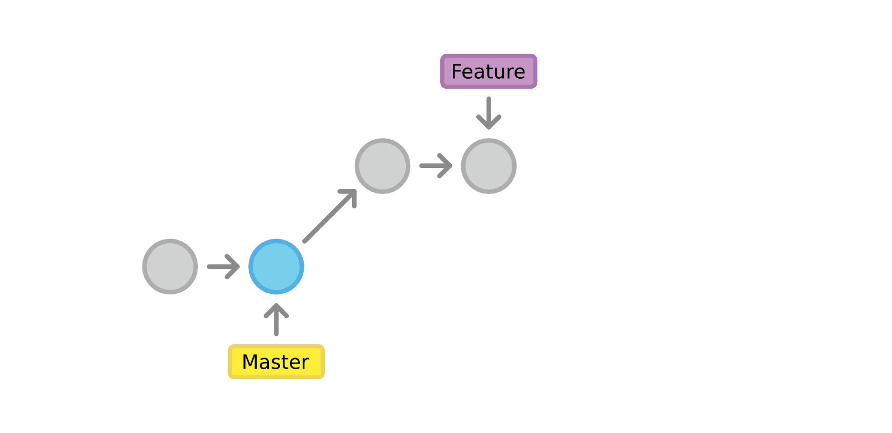

---

<!-- .slide: data-transition="none" -->

## Feature branch

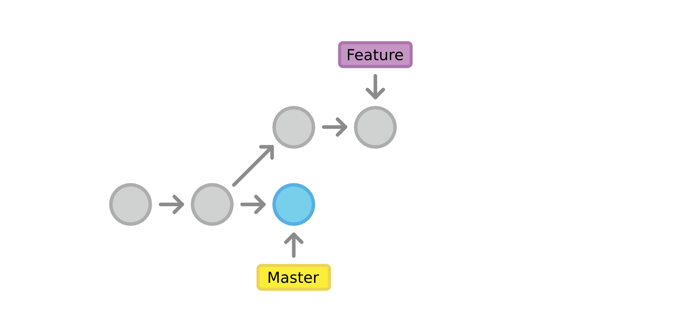

---

<!-- .slide: data-transition="none" -->

## Feature branch

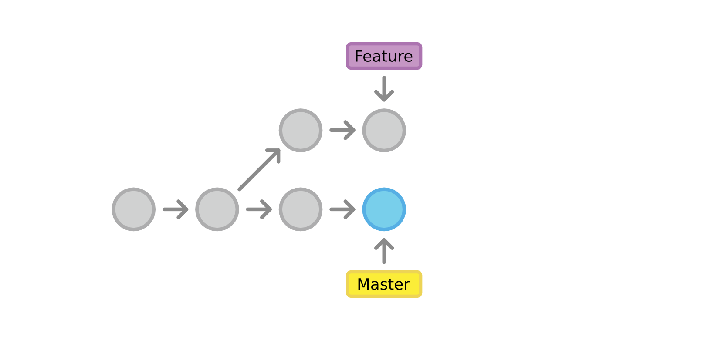

---

<!-- .slide: data-transition="none" -->

## Feature branch


---

<!-- .slide: data-transition="none" -->

## Git merge

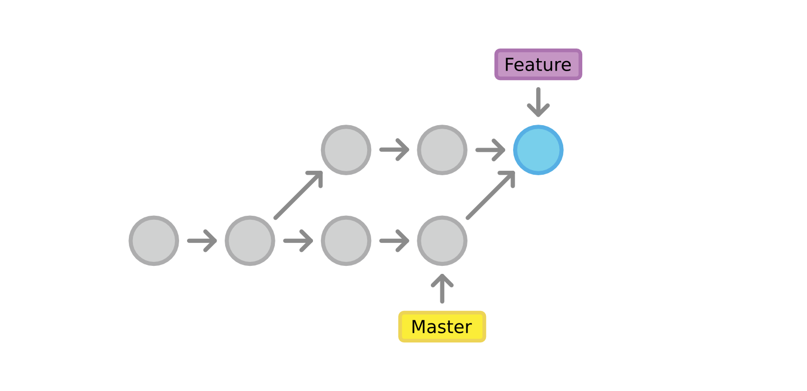

---

<!-- .slide: data-transition="none" -->

## Feature branch

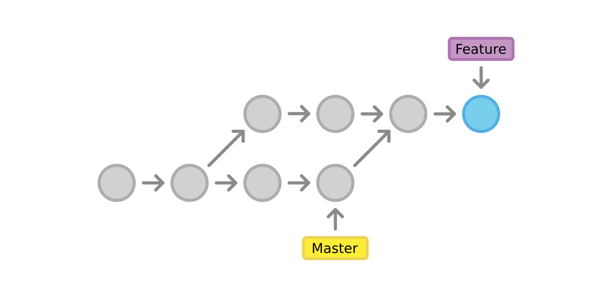

---

<!-- .slide: data-transition="none" -->

## Git merge

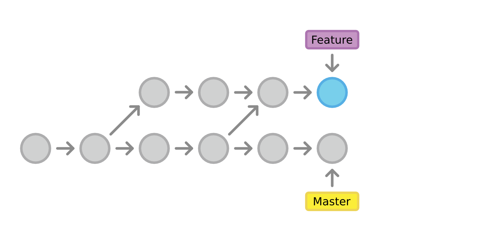

---

<!-- .slide: data-transition="none" -->

## Git merge


---

<!-- .slide: data-transition="none" -->

## Feature branch


---

<!-- .slide: data-transition="none" -->

## Git rebase

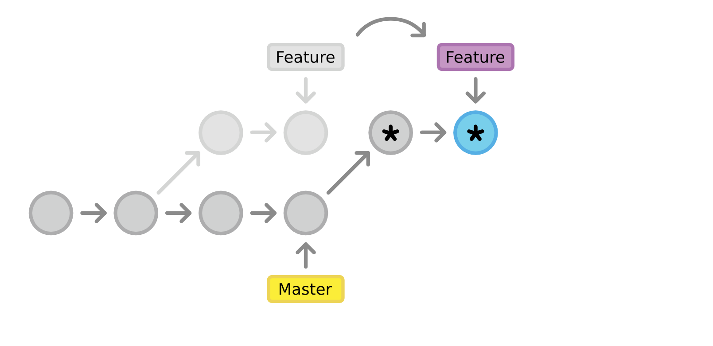

---

<!-- .slide: data-transition="none" -->

## Git rebase

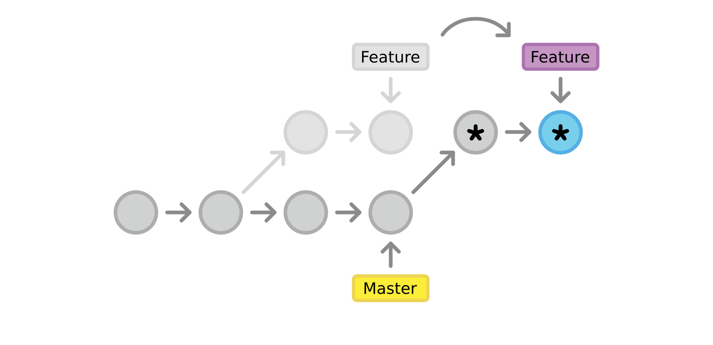

---

<!-- .slide: data-transition="none" -->

## Git rebase

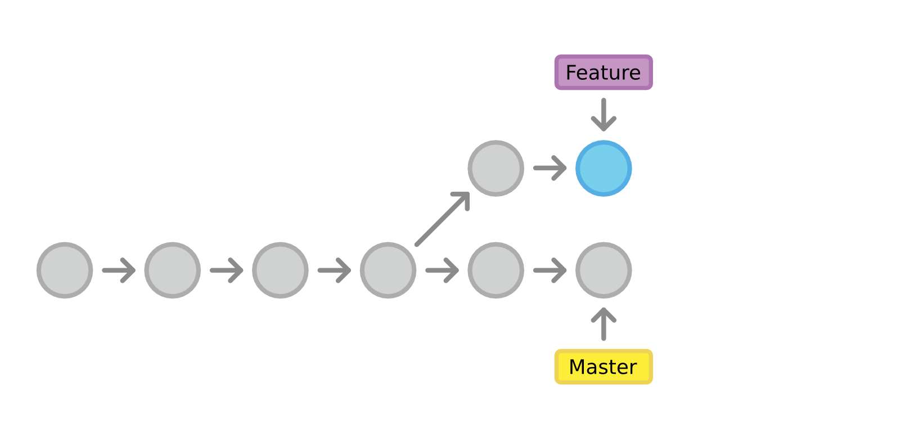

---

<!-- .slide: data-transition="none" -->

## Git rebase

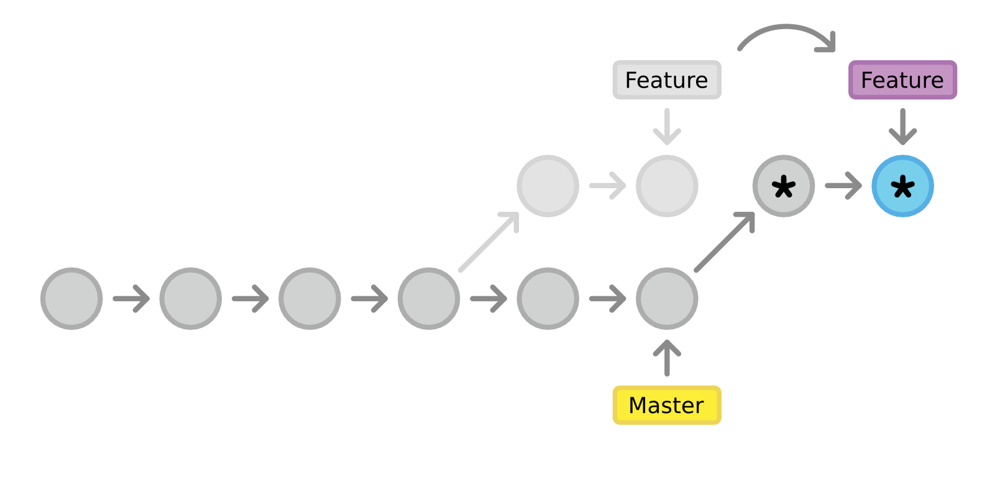

---

<!-- .slide: data-transition="none" -->

## Git rebase

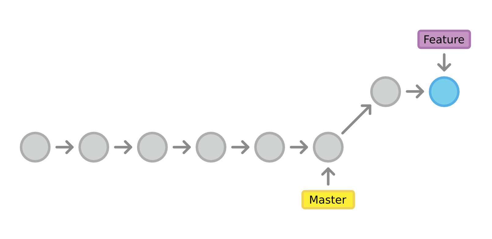

---

<!-- .slide: data-background="img/clean-vs-dirty-water.jpg" data-background-size="cover" -->

<!-- .element: class="fullImageCaption" -->
Git merge vs rebase

---

<!-- .slide: class="oneColList" -->

##Git merge vs rebase

* ;-) historique simple
* :-( perte du contexte de travail
* :-( plus difficile à maitriser

---

<!-- .slide: data-background="#5A0000" class="warningTitle" -->

#Git merge vs rebase

###attention au rebase de commits partagés

---

<!-- .slide: data-background="#F5AF33" class="codeTitle" -->

# `git rebase -i ?`

---

<!-- .slide: data-transition="none" -->

## Git rebase interactive

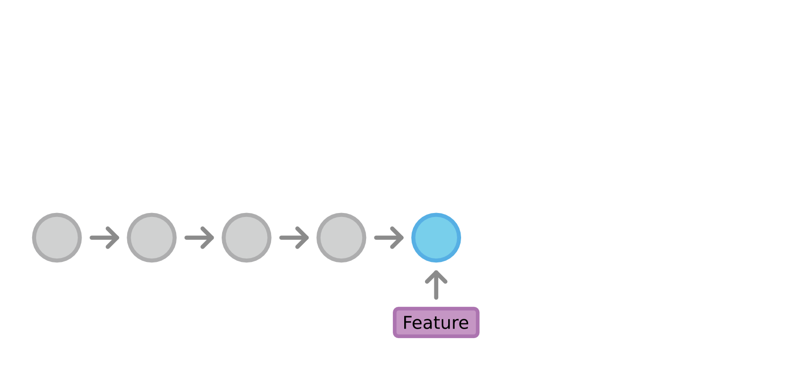

---

<!-- .slide: data-transition="none" -->

## Git rebase interactive

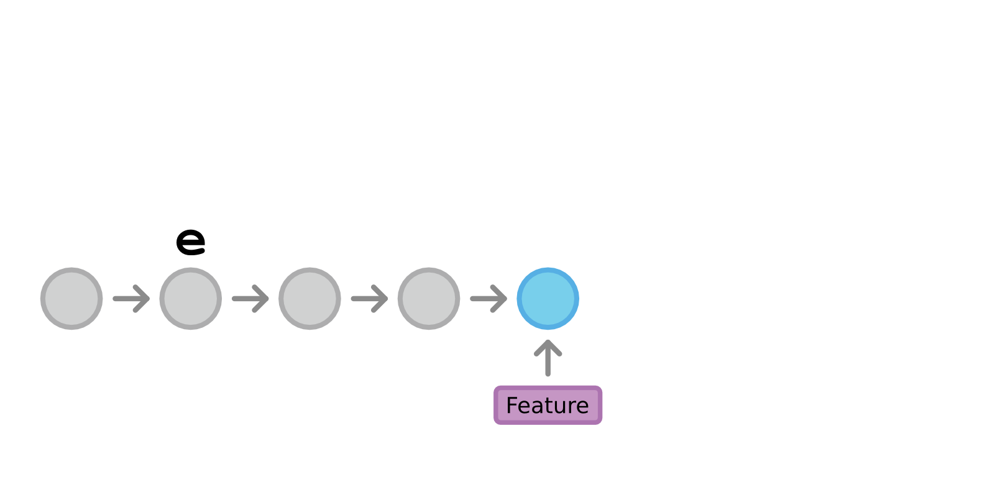

---

<!-- .slide: data-transition="none" -->

## Git rebase interactive

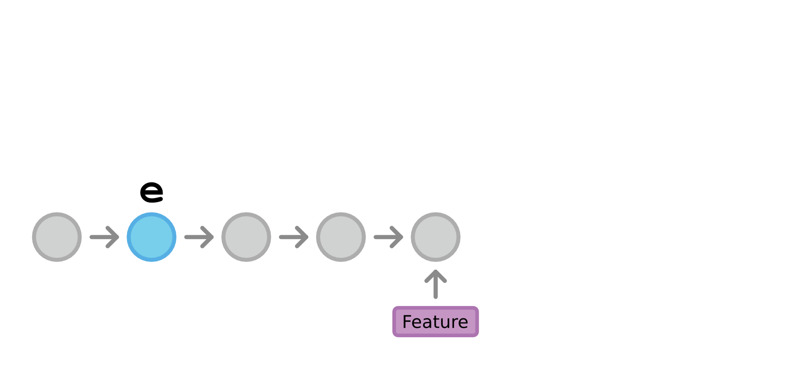

---

<!-- .slide: data-transition="none" -->

## Git rebase interactive

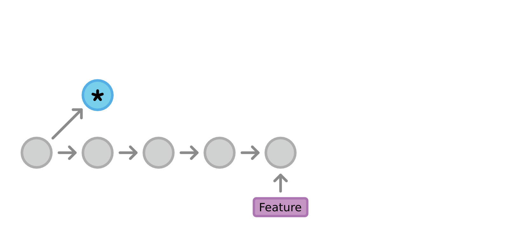

---

<!-- .slide: data-transition="none" -->

## Git rebase interactive

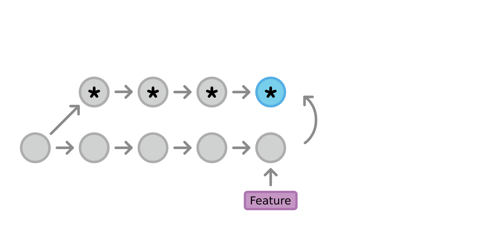

---

<!-- .slide: data-transition="none" -->

## Git rebase interactive

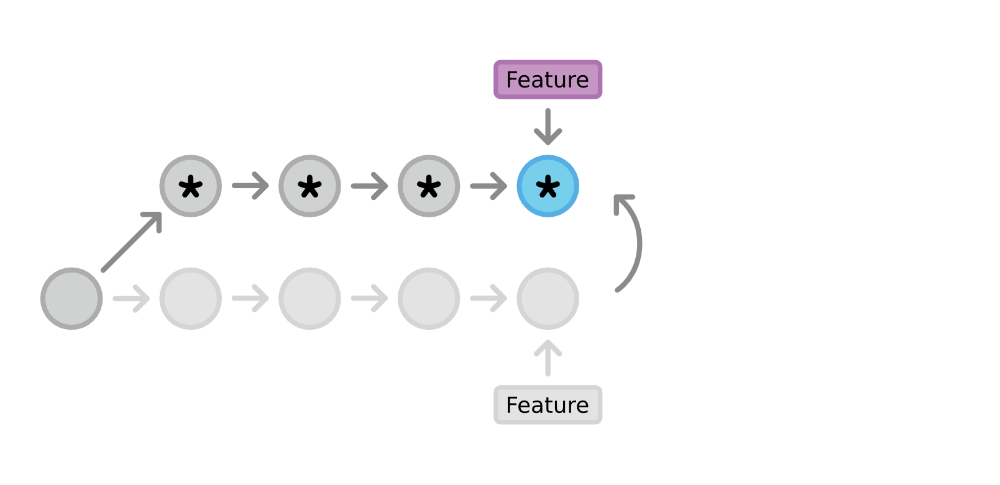

---

<!-- .slide: data-transition="none" -->

## Git rebase interactive

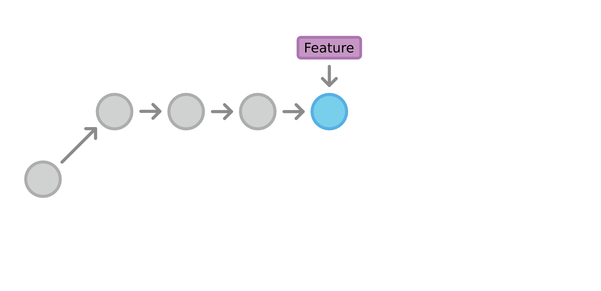

---

<!-- .slide: data-background="#F5AF33" -->

#DEMO

---

<!-- .slide: class="oneColList" -->

##Git rebase ? Git commit ? Git merge ?

* Code privé ? rebase
* Code review ? commit
* Code ready ? rebase
* Code merge ? merge !

---

<!-- .slide: data-background="#F5AF33" -->

#Changelog

---

<!-- .slide: data-background="img/changelog.png" data-background-size="contain" -->

---

<!-- .slide: data-background="#F5AF33" -->

#DEMO
