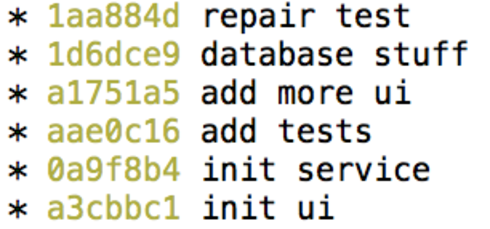
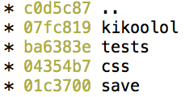
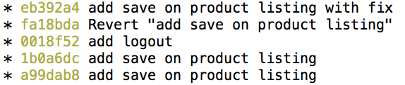
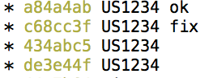
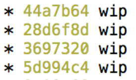

# Git++ : Passez au niveau supérieur de la gestion de version

---

## Historique crappy

---

### Commit by stack



---

### Merge


---

### One word commit



---

### Revert



---

### Test


---

### US1234



---

### WIP



---

## Qualité de l'historique du code ? Pourquoi faire ?

---

## Donner du sens aux changements du code: quoi ? où ? pourquoi ? (comment ?)

---

```
feat(login): reset password on demand


send an email with unique reset url
display a form to define a new password

Closes #1234
```

(quoi ? où ? (pour)quoi ? (comment ?) (référence?))

---

## Faciliter la compréhension de l'historique, par exemple:

* A l'arrivée d'un nouveau
* au retour de congés
* pour des code reviews (a)synchrones

---

```
Changelog (en image)

v5.8.2 (2014-02-21)

Bug Fixes

family:
	split files into services and directives (3a15c697)
	update style on multiple checks on queries (97185f0e)
queryPicker: replace != by ≠ in query picker operands (f16b3f7c)

Features

form: add empty fields behavior info message (23882829)
```

---

## Ce qu'il faut savoir faire sur un commit :

---

### Renommer ...

---

### Modifier ...

---

### Réordonner ...

---

### Fusionner ...

---

### Supprimer ...

---

### Découper ...

---

## Collaboration

Préférer le rebase au merge pour la lisibilité et la simplicité

plus complexe, perte d'informations

stash is crappy ! commit wip then rebase it!

