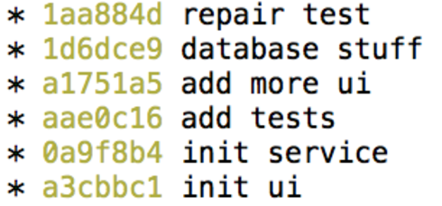
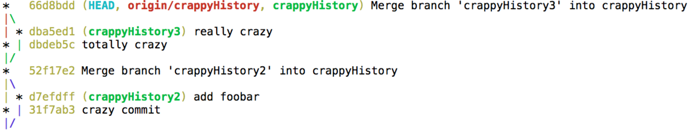
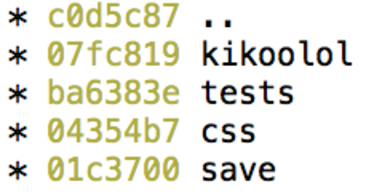
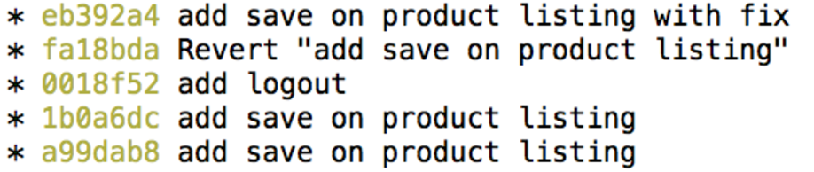
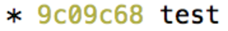
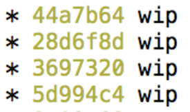
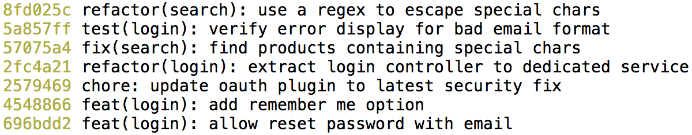

# Git++ : Passez au niveau supérieur de la gestion de version

---

## Historique crappy

---

### Commit by stack



---

### Merge



---

### One word commit



---

### Revert



---

### Test



---

### US1234


---

### WIP



---

## Qualité de l'historique du code ? Pourquoi faire ?

---

### Un historique propre



---

### Perte de mémoire


---

### Retour de vacances


---

### Arrivée d'un nouveau


---


---

# Donner du sens aux changements du code

<br/>
###Quoi ? Où ? (Pour)quoi ? (Comment ?) (Référence?)

---

## Convention de Commit

```txt
<type>(<scope>): <subject>
<BLANK LINE>
<body>
<BLANK LINE>
<footer>
```
<br/>
###Quoi ? Où ? (Pour)quoi ? (Comment ?) (Référence?)

---

## Exemple 1
<br/>

```
feat(search): add automatic suggestions

we now use the new feature from the search API to provide
instant suggestions just below search inputs

* update component implementation to support automatic suggestion
* update component tests
* update component documentation
```
<br/>
###Quoi ? Où ? (Pour)quoi ? (Comment ?) (Référence?)

---
## Exemple 2
<br/>


```
feat(login): reset password on demand

send an email with unique reset url
display a form to define a new password

Closes #1234
```
<br/>
###Quoi ? Où ? (Pour)quoi ? (Comment ?) (Référence?)

---

## Exemple 3
<br/>


```
fix(search): find products containing special chars

escape specials chars before search API call

special characters: \+-&|!(){}[]^"~*?:
see related doc at: http://lucene.apache.org/core/4_7_0/queryparser/org/apache/lucene/queryparser/classic/package-summary.html#Escaping_Special_Characters

Closes #789
```
<br/>
###Quoi ? Où ? (Pour)quoi ? (Comment ?) (Référence?)

---
##Type: Quoi?

* feat: Une fonctionnalité
* fix: Un correctif
* refactor: Un changement de code qui n'est ni une fonctionnalité ni un correctif
* chore: Un changement dans le processus de construction ou configuration d'un outil auxiliaire utilisé pour tester le code
<br/>
<br/>
* test: Un test manquant
* docs: Un changement dans la documentation
* style: Un changement de formattage
---
##Scope: Où?

Choississez vos scopes, listez les et faites les évoluer au cours du temps

* product
* editorial
* family
* model
* attribut
<br/>
<br/> 
* (optionnel)

---
##Subject: (Pour)quoi?

Description des changements et de ce que cela implique

##Body: Comment?

* (optionnel)

##Footer: Référence?

* (optionnel)

###Breaking Changes

* (optionnel)

---

## Changelog
<br/>

```
Changelog (mettre une image)

v5.8.2 (2014-02-21)

Bug Fixes

family:
	split files into services and directives (3a15c697)
	update style on multiple checks on queries (97185f0e)
queryPicker: replace != by ≠ in query picker operands (f16b3f7c)

Features

form: add empty fields behavior info message (23882829)
```

---
##Git rebase


---
##Git rebase


---
##Git merge


---
##Git rebase


---
##Git merge vs rebase

* \+ historique simple
* \- perte du contexte de travail
* \- plus difficile à maitriser

<br/>
###attention au rebase de commits publiques

---
##Git merge vs rebase


---

## Ce qu'il faut savoir faire sur un commit :

* Renommer
* Modifier
* Réordonner
* Fusionner
* Supprimer
* Découper
